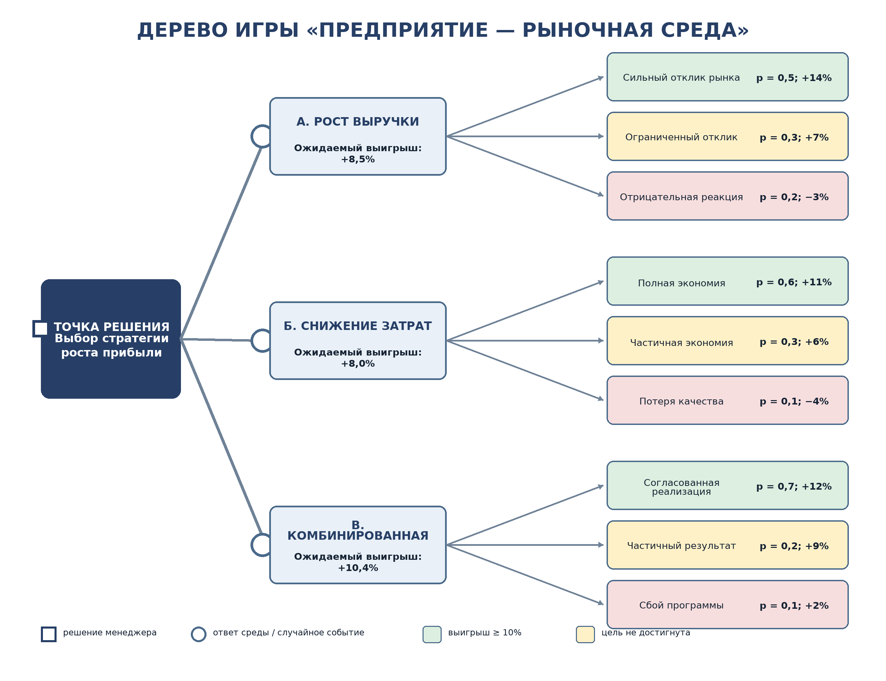
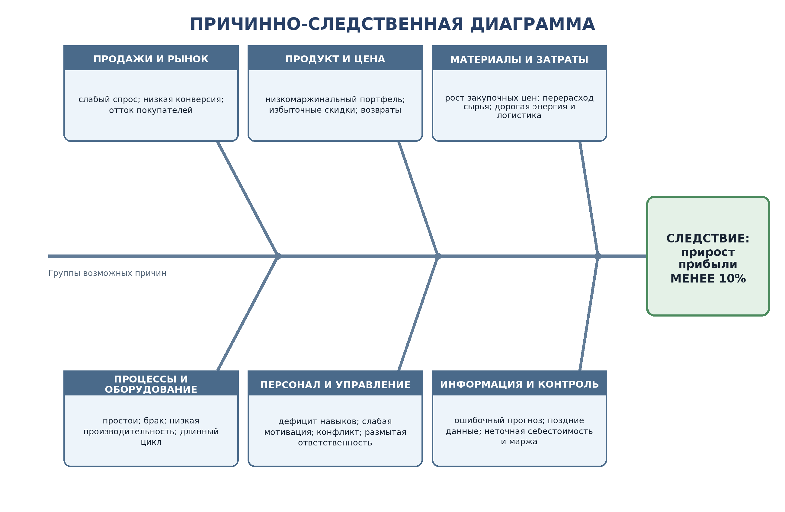

# ПРАКТИЧЕСКАЯ РАБОТА № 3

## «Принятие решений менеджером»

**Исполнитель:** студент группы П-41 Соловьев А. С.  
**Тема письма:** `П-41_Соловьев_АС_ПЗ-03`  
**Год выполнения:** 2016

---

## 1. Название и цель работы

**Название работы:** «Принятие решений менеджером».

**Цель работы:** овладеть навыками практического использования системного подхода к решению проблем на разных уровнях принятия управленческих решений, научиться определять доминирующий уровень решения, применять рациональный подход и визуальные методы анализа — дерево решений в форме дерева игры и причинно-следственную диаграмму [1, с. 136–141, 173–175].

## 2. Список исполнителей

Соловьев А. С., группа П-41.

## 3. Теоретическая основа анализа

В учебном пособии выделены четыре уровня принятия управленческих решений [1, с. 136–137].

| Уровень | Содержание | Характерные признаки и навыки |
|---|---|---|
| 1. Рутинный | Выполнение знакомой, повторяющейся работы по известной программе или процедуре. | Распознавание типовой ситуации, точное следование процедуре, разумная оценка, контроль и мотивация. |
| 2. Селективный | Выбор наиболее подходящего решения из нескольких известных и отработанных альтернатив в заданных границах. | Постановка целей, планирование, анализ информации, сопоставление вариантов и выбор. |
| 3. Адаптационный | Создание нового для данной ситуации решения известной проблемы путём сочетания проверенных возможностей и новых идей. | Идентификация проблемы, систематизированное решение, работа группы, анализ риска и приспособление решения к изменившимся условиям. |
| 4. Инновационный | Поиск принципиально нового подхода к плохо определённой проблеме, для которой нет готового способа решения. | Творческое управление, стратегическое планирование, системное развитие, создание новых концепций, инструментов и технологий. |

Уровни не являются оценкой должности или личности менеджера. Они характеризуют прежде всего структуру, новизну и неопределённость конкретной ситуации.

## 4. Анализ четырёх ситуаций

### 4.1. Ситуация 1 — небольшой обувной магазин

**Доминирующий уровень: 1-й, рутинный, с элементами 2-го, селективного.**

Основная часть работы заранее запрограммирована головным офисом: разработаны процедуры рассмотрения жалоб, решения кадровых вопросов, проведения выставок, оформления заказов и ведения документации; задача руководителя — «пунктуально выполнять предписания компании» [1, с. 173]. Это прямо соответствует рутинному уровню.

Элементы селективного уровня возникают при непредвиденных обстоятельствах и необходимости самостоятельно принять важное решение. Однако свобода менеджера ограничена требованиями компании и согласованием с вышестоящим руководством, поэтому более высокий уровень не является доминирующим.

### 4.2. Ситуация 2 — руководитель производственного отдела

**Доминирующий уровень: 2-й, селективный, с отдельными элементами 3-го, адаптационного.**

Руководитель действует в достаточно свободных условиях и выбирает среди альтернатив по вопросам контроля качества, использования материалов, должностных перемещений и отношений работников. В тексте указано, что большинство проблем уже появлялось прежде, а задача руководителя заключается в выборе образа действий, который с наибольшей вероятностью приведёт к успеху [1, с. 173–174]. Это признаки селективного уровня.

Адаптационные элементы проявляются в необходимости приспосабливаться к внешним факторам, сочетать рациональный анализ с «чувством» ситуации и корректировать известные решения. При этом принципиально нового подхода обычно не требуется.

### 4.3. Ситуация 3 — отдел маркетинга

**Доминирующий уровень: 3-й, адаптационный, с элементами 2-го, селективного.**

Отдел должен создавать новые возможности решения хорошо известных проблем: искать новые подходы к рекламе и методы активизации сбыта. Сначала требуется прояснить и упростить проблему, собрать информацию, затем сочетать способность выбирать с «подлинной новизной» и деловой осмысленностью [1, с. 174]. Следовательно, известная проблема решается в новой форме — это сущность адаптационного уровня.

Селективные элементы сохраняются, поскольку менеджер анализирует информацию и отбирает из идей пригодный вариант. Однако простой выбор из готовых программ не обеспечивает требуемой новизны.

### 4.4. Ситуация 4 — руководитель исследовательского центра

**Уровень: 4-й, инновационный.**

Руководитель начинает с «достаточно плохо определённой проблемы, к которой не подходит ни одно из известных решений». Для результата могут понадобиться новый технический язык, концепции, инструменты, технологии или производственные возможности [1, с. 174]. Это точное совпадение с признаками инновационного уровня: проблема уникальна, готовой программы нет, а итог должен обладать подлинной новизной.

### 4.5. Связь уровня решения со старшинством должности

Прямой однозначной связи между должностным старшинством и уровнем решения **нет**. Руководители верхнего уровня чаще сталкиваются со стратегическими и инновационными вопросами, однако могут принимать рутинные решения по установленным регламентам. Руководитель низового или среднего звена также способен встретиться с новой аварийной, кадровой или рыночной ситуацией, требующей адаптационного либо инновационного решения.

Таким образом, уровень определяется не названием должности, а повторяемостью проблемы, наличием готовой процедуры, числом известных альтернатив, степенью неопределённости и требуемой новизной ответа.

## 5. Одна практическая задача, решаемая на четырёх уровнях

**Практическая задача:** организовать подготовку студента к зачёту по учебному курсу.

| Уровень | Вариант решения задачи | Почему соответствует уровню |
|---|---|---|
| 1. Рутинный | Выполнить привычную программу: перечитать конспект, выучить определения по готовому списку вопросов, решить типовой тест, проверить наличие всех работ. | Содержание и порядок действий заранее известны и уже применялись. Требуется дисциплинированно исполнить программу. |
| 2. Селективный | Оценить оставшееся время и пробелы, затем выбрать из готовых способов: лекции, учебник, карточки, тренировочные тесты, консультация или занятия с группой. | Меняется не принцип подготовки, а выбирается наиболее подходящая комбинация известных альтернатив. |
| 3. Адаптационный | Если обычная подготовка не даёт результата, создать индивидуальную схему: карту понятий, интервальное повторение, короткие устные защиты и разбор ошибок после каждого пробного теста. | Известные методы объединяются и приспосабливаются к конкретным ошибкам и ограничению времени; решение ново для данной ситуации. |
| 4. Инновационный | Разработать и испытать новый формат подготовки: адаптивный тренажёр, который строит граф знаний, формирует вопросы по выявленным связям и меняет сложность после каждого ответа, дополняя его системой взаимной микрозащиты студентов. | Создаётся новый инструмент и новая организация процесса, а не выбирается готовая программа. Результат заранее не гарантирован и требует эксперимента. |

Одна и та же конечная цель не задаёт уровень решения автоматически: уровень меняется в зависимости от того, используется ли готовая процедура, производится выбор, выполняется адаптация или создаётся принципиально новый способ.

## 6. Ответ на вопрос задания 2

### 6.1. Программа подготовки и отправки учебной работы

При первой сдаче электронной работы беспокойство вызывали требования к структуре, формату файла, теме письма, сроку и подтверждению получения. Постепенно сформировалась программа:

1. прочитать требования и выписать обязательные элементы;
2. подготовить работу по шаблону;
3. проверить название файла и тему письма;
4. открыть итоговый файл и проверить отображение таблиц и рисунков;
5. отправить работу и убедиться, что она доставлена;
6. сохранить отправленный файл и подтверждение.

Эта программа использовалась впоследствии для других практических работ. В типовой ситуации она относится к **1-му, рутинному уровню**. Если преподаватель изменяет формат или канал сдачи, появляется селективный элемент: необходимо выбрать способ адаптации известной процедуры.

### 6.2. Программа подготовки к устной защите

Первая защита вызывала затруднения из-за неизвестной формы вопросов и необходимости отвечать без чтения текста. После нескольких попыток сформировалась программа:

1. составить список терминов и контрольных вопросов;
2. дать каждому понятию краткое определение своими словами;
3. подготовить пример и контрпример;
4. провести две пробные защиты с таймером;
5. записать ошибки и повторить слабые темы;
6. накануне выполнить краткое контрольное повторение.

Программа применима на **1-м уровне**, если формат защиты знаком и повторяется. При выборе между письменной тренировкой, обсуждением в группе и устной репетицией возникает **2-й, селективный уровень**.

### 6.3. Всегда ли готовый ответ правилен

Готовый ответ не всегда правилен. Он может быть рассчитан на другие условия, устареть, устранять симптом вместо причины или не учитывать новый критерий и риск. Программа полезна только после распознавания ситуации. Если существенные признаки изменились, механическое следование прежнему алгоритму создаёт ошибку; требуется выбрать другой вариант, адаптировать программу либо заново определить проблему.

## 7. Задание 3: рациональный подход к трём управленческим вопросам

Для конкретизации выбрана **ситуация 2 — производственный отдел**. Его руководитель работает с качеством, материалами, персоналом и производственными отношениями, располагает несколькими известными альтернативами и несёт личную ответственность за выбор [1, с. 173–174].

В исходной формулировке три пункта названы проблемами. На стадии обнаружения это действительно проблемы — разрыв между текущим и желаемым состоянием. После уточнения результата, срока, критериев и ответственного они становятся управленческими задачами.

Рациональный подход включает три повторяемые стадии [1, с. 138–139]:

1. **Обдумывание:** распознать и точно определить проблему, отличить её от симптома, собрать информацию, установить обязательные и желательные критерии.
2. **Проект:** систематически сформировать несколько обычных и новых вариантов, провести консультации, определить последствия, ресурсы и риски.
3. **Выбор:** проверить варианты по критериям, выбрать лучший, составить план реализации и контроля. Если приемлемого варианта нет, переопределить проблему или критерии и повторить цикл.

### 7.1. Приём сотрудника на вакантную должность

**Обдумывание.**

- Проверить, является ли причиной перегрузки именно вакансия, а не неэффективное распределение работы или лишние операции.
- Определить результат: закрыть должность к установленной дате без выхода за фонд оплаты труда и без снижения качества.
- Собрать сведения о фактической загрузке, функциях должности, бюджете, рынке труда и опыте прошлых наймов.
- Установить обязательные критерии: профессиональная компетентность, законность оформления, соответствие зарплатному бюджету, доступность к нужному сроку. Желательные: отраслевой опыт, коммуникация, потенциал развития.

**Проект.**

- Сформировать альтернативы: внутренний перевод; внешний найм; временный сотрудник; кадровое агентство; передача части функций подрядчику; перераспределение или автоматизация работы без найма.
- Провести консультации с кадровой службой, будущими коллегами и финансовым подразделением.
- Для каждого варианта определить стоимость, срок, риск ошибочного найма и ожидаемую производительность.

**Выбор и реализация.**

- Отсеять варианты, не удовлетворяющие обязательным критериям; остальные оценить по единой шкале.
- Выбрать, например, внешний конкурс с временным внутренним распределением функций до выхода сотрудника.
- Утвердить профиль вакансии, ответственных, этапы интервью, проверочное задание и срок.
- После приёма контролировать результат по плану адаптации и показателям испытательного срока. Если кандидат не достигает минимальных критериев, вернуться к альтернативам.

### 7.2. Покупка или аренда производственного помещения

**Обдумывание.**

- Уточнить, является ли помещение действительной причиной ограничения выпуска; проверить возможность повысить загрузку имеющихся площадей.
- Определить горизонт потребности, требуемую площадь, логистику, энергоснабжение, безопасность, разрешённое использование и прогноз объёма производства.
- Установить обязательные критерии: техническая пригодность, соблюдение норм, доступность к сроку, финансовый лимит. Желательные: возможность расширения, транспортная доступность, гибкость выхода из проекта.

**Проект.**

- Сформировать варианты: покупка готового здания; долгосрочная аренда; аренда с правом выкупа; строительство; совместное использование площадки; модернизация действующего помещения.
- Для каждого варианта рассчитать совокупную стоимость владения, денежный поток, срок запуска, стоимость переезда и прекращения договора.
- Рассмотреть сценарии высокого, базового и низкого спроса, юридические и технические риски.

**Выбор и реализация.**

- Сопоставить варианты по стоимости, сроку, гибкости и риску. При нестабильном спросе рациональным предварительным выбором является аренда с правом выкупа: она снижает первоначальные вложения и сохраняет возможность закрепить объект.
- Провести техническую и юридическую проверку, согласовать договор, план переезда и контрольные показатели использования площади.
- Через установленный период повторно проверить прогноз: при устойчивой загрузке реализовать выкуп, при недозагрузке изменить площадь или отказаться от продления.

### 7.3. Поиск путей достижения 10-процентного роста прибыли

**Обдумывание.**

- Точно определить показатель: рост операционной прибыли не менее чем на 10% за 12 месяцев относительно согласованной базы.
- Разложить прибыль на факторы выручки и затрат; проверить, не вызвано ли снижение разовым событием.
- Собрать данные по цене, объёму, продуктовой марже, браку, простоям, закупкам, производительности и каналам продаж.
- Установить обязательные критерии: ожидаемый прирост не менее 10%, соблюдение закона и безопасности, сохранение минимального качества и ликвидности. Желательные: окупаемость до года, отсутствие массового сокращения, обратимость пилота.

**Проект.**

- Сформировать варианты: повышение цены и изменение продуктового портфеля; рост продаж; снижение закупочных цен; уменьшение брака и простоев; повышение производительности; комбинированная программа.
- Провести консультации производства, маркетинга, продаж, финансов и снабжения.
- Оценить варианты в сценариях реакции покупателей и конкурентов. Для визуальной проверки использовать причинно-следственную диаграмму и дерево игры.

**Выбор и реализация.**

- Сравнить ожидаемый выигрыш и риск. По приведённым ниже условным оценкам комбинированная стратегия имеет ожидаемый результат 10,4% и превосходит односторонние варианты.
- Запустить пилоты: корректировка цены и продуктового набора, переговоры с поставщиками, снижение брака на выбранной линии и адресная кампания продаж.
- Назначить владельцев показателей и ежемесячно контролировать маржу, объём, себестоимость, брак и денежный поток.
- Если промежуточный результат ниже траектории, пересмотреть причины, критерии и набор действий, то есть повторить рациональный цикл.

## 8. Визуализация решения задания 3

### 8.1. Дерево решений в версии «дерево игры»

Для задачи роста прибыли используется дерево игры «предприятие — рыночная среда». Квадрат обозначает точку принятия решения менеджером, круги — ответ внешней среды, конечные узлы — выигрыш или проигрыш в виде изменения прибыли. Вероятности и проценты являются **условными экспертными оценками для учебного примера**, а не фактами из исходной ситуации.

**Рисунок 1 — Дерево игры для выбора стратегии роста прибыли**

| Стратегия | Возможные ответы среды | Расчёт ожидаемого выигрыша | Ожидаемый результат |
|---|---|---|---|
| А. Рост выручки | Сильный отклик: 0,5 и +14%; ограниченный: 0,3 и +7%; отрицательный: 0,2 и −3%. | 0,5 × 14 + 0,3 × 7 − 0,2 × 3 | +8,5% |
| Б. Снижение затрат | Полная экономия: 0,6 и +11%; частичная: 0,3 и +6%; потеря качества: 0,1 и −4%. | 0,6 × 11 + 0,3 × 6 − 0,1 × 4 | +8,0% |
| В. Комбинированная программа | Согласованная реализация: 0,7 и +12%; частичный результат: 0,2 и +9%; сбой: 0,1 и +2%. | 0,7 × 12 + 0,2 × 9 + 0,1 × 2 | **+10,4%** |

По критерию максимального ожидаемого прироста выбирается стратегия В. Она обеспечивает выигрыш выше целевых 10% в среднем, но не устраняет риск неблагоприятного исхода; поэтому решение дополняется пилотами и контрольными точками.

### 8.2. Причинно-следственная диаграмма

Диаграмма построена для следствия **«прирост прибыли менее 10%»**. Она не даёт готового ответа, но систематизирует направления поиска причин и препятствует преждевременному выбору единственного объяснения [1, с. 140].

**Рисунок 2 — Причинно-следственная диаграмма недостижения целевого роста прибыли**

| Группа причин | Проверяемые показатели | Возможные компенсирующие действия |
|---|---|---|
| Продажи и рынок | Число заказов, конверсия, средний чек, отток покупателей. | Сегментация, новые каналы, улучшение воронки, адресные предложения. |
| Продукт и цена | Маржа по продуктам, скидки, доля низкомаржинальных позиций, возвраты. | Изменение продуктового портфеля и цены, отказ от убыточных позиций. |
| Материалы и затраты | Закупочные цены, расход материала, энергия, логистика. | Переговоры с поставщиками, нормы расхода, снижение потерь и энергозатрат. |
| Процессы и оборудование | Простои, производительность, длительность цикла, загрузка. | Профилактика, устранение узких мест, стандартизация операций. |
| Персонал и управление | Выработка, текучесть, квалификация, конфликты, исполнение решений. | Обучение, мотивация, распределение ответственности, урегулирование конфликтов. |
| Информация и контроль | Точность прогноза, своевременность данных, расчёт себестоимости и маржи. | Управленческая панель, единые определения показателей, регулярный факторный анализ. |

## 9. Выводы

1. Четыре описанные ситуации последовательно иллюстрируют рутинный, селективный, адаптационный и инновационный уровни. При этом в реальной деятельности один уровень может доминировать, сохраняя элементы соседнего более высокого уровня.
2. Уровень решения не определяется должностью автоматически. Решающими являются повторяемость и определённость проблемы, наличие готовой процедуры, число известных альтернатив и необходимая степень новизны.
3. Одна и та же задача подготовки к зачёту может решаться на всех четырёх уровнях: от исполнения готового плана до разработки нового адаптивного инструмента.
4. Готовая программа снижает затраты времени в типовой ситуации, но становится источником ошибки, если менеджер неверно распознал условия или механически использовал устаревший ответ.
5. Рациональный подход переводит проблему в управляемую задачу через определение причин и критериев, разработку альтернатив, проверку вариантов, выбор, реализацию и обратную связь.
6. Дерево игры показывает последовательность выбора, реакцию среды, риск, выигрыш и проигрыш. Причинно-следственная диаграмма дополняет его, раскрывая группы причин недостижения целевого результата.
7. Для учебного примера роста прибыли комбинированная стратегия имеет наибольший ожидаемый выигрыш — 10,4%, однако окончательное решение допустимо только после проверки исходных оценок и результатов пилотных мероприятий.

## 10. Список использованных источников

1. Лукычёва Л. И. Управление организацией: учебное пособие по специальности «Менеджмент организации» / Л. И. Лукычёва; под ред. Ю. П. Анискина. — 3-е изд., стер. — М.: Омега-Л, 2006. — 360 с. — ISBN 5-98119-986-5. — С. 136–141, 173–175.
2. Ожегов С. И., Шведова Н. Ю. Толковый словарь русского языка: 80 000 слов и фразеологических выражений. — 4-е изд., доп. — М.: Азбуковник, 1999. — 944 с.

## Приложение А. Краткий словарь терминов для защиты

**Дерево решений** — графическая модель последовательных вариантов решения, возможных событий, результатов и, при необходимости, их вероятностей и выигрышей.

**Дерево игры** — дерево решений, в котором показана последовательность ходов участников стратегического взаимодействия или менеджера и внешней среды; в узлах обозначается, кто делает ход, а в конечных вершинах — выигрыши и проигрыши.

**Теория игр** — совокупность методов анализа ситуаций, где результат каждого участника зависит не только от его действий, но и от решений других участников.

**Причина** — обстоятельство или процесс, порождающие либо изменяющие другое явление.

**Следствие** — результат действия одной или нескольких причин.

**Проблема** — разрыв или противоречие между фактическим и желаемым состоянием, способ устранения которого ещё требуется найти.

**Задача** — конкретизированный результат, который необходимо получить в установленных условиях, сроках и ограничениях.

**Рутина** — регулярно повторяющаяся деятельность, выполняемая по известной процедуре без необходимости создавать новый способ решения.

**Селекция** — отбор допустимых и предпочтительных альтернатив из заранее известного множества по установленным критериям.

**Выбор** — акт принятия одной альтернативы или определённого набора действий как решения.

**Адаптация** имеет два взаимосвязанных направления: 1) приспособление решения и организации к изменившимся условиям; 2) активное изменение внутренних процессов или доступной части среды под выбранную цель.

**Риск** — возможность отклонения фактического результата от ожидаемого, включая вероятность потерь или недостижения цели.

**Анализ** — мысленное или практическое разложение объекта и ситуации на элементы, связи и факторы для их изучения.

**Ответственность** — обязанность лица обосновать принятое решение и отвечать за его исполнение и последствия в пределах полномочий.

**Новация** — новая идея, метод, разработка или продукт, ещё не обязательно внедрённые и давшие практический эффект.

**Инновация** — внедрённая новация, которая используется на практике и создаёт измеримый полезный эффект.

**Диаграмма** — условное графическое представление данных, структуры, связей или последовательности действий.

**Визуализация** — представление информации в наглядной графической форме для облегчения анализа и понимания.

**Стратегия** — общее долгосрочное направление действий и распределения ресурсов для достижения цели.

**Тактика** — конкретные краткосрочные действия и приёмы реализации стратегии в текущих условиях.

**Выигрыш** — полезный результат участника при определённом сочетании действий; в дереве игры может выражаться прибылью, временем, баллами или иной мерой.

**Проигрыш** — отрицательный результат, потеря или недостижение установленного критерия.

**Альтернатива** — взаимоисключающий способ действия, выбираемый вместо другого способа.

**Вариант** — конкретное возможное исполнение решения; варианты могут различаться деталями внутри одной альтернативы.

**Точка принятия решения** — узел процесса или дерева, в котором уполномоченное лицо должно выбрать дальнейшее действие из нескольких доступных направлений.
