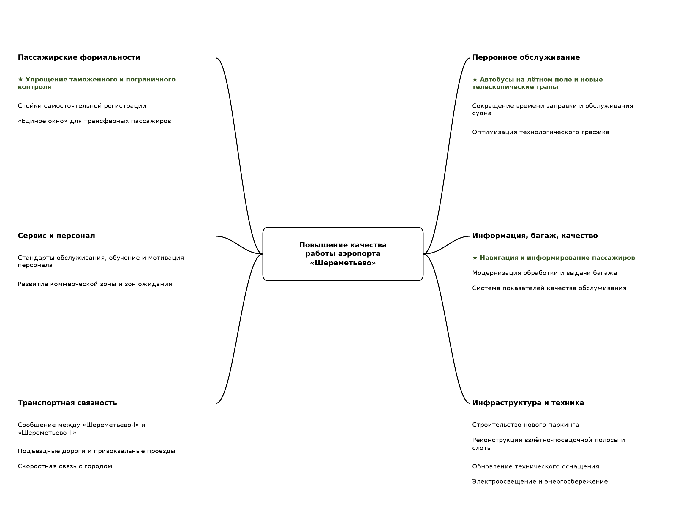

# ПРАКТИЧЕСКАЯ РАБОТА № 4

## «Принятие решений в режиме мозговой атаки с применением интеллект-карт»

**Исполнитель:** студент группы П-41 Соловьев А. С.  
**Тема письма:** `П-41_Соловьев_АС_ПЗ-04`  
**Год выполнения:** 2026

---

## 1. Название и цель работы

**Название работы:** «Принятие решений в режиме мозговой атаки с применением интеллект-карт (на примере аэропорта «Шереметьево»)».

**Цель работы:** привить навыки проведения «мозгового штурма», навыки анализа ситуации и выбора вариантов решения с помощью методов активизации творчества, а также закрепить умение фиксировать и структурировать коллективный результат в форме интеллект-карты [1, с. 176–178].

## 2. Список исполнителей

Соловьев А. С., группа П-41.

Для проведения процедуры предусмотрено функциональное разделение учебной группы на две подгруппы: **генераторов идей** и **критиков-экспертов**. В каждой подгруппе выбирается руководитель. Координация процедуры, фиксация итогов и подготовка отчёта выполнены Соловьевым А. С.; персональный состав остальных участников определяется на занятии.

## 3. Исходная ситуация и постановка задачи

**Ситуация.** Аэропорт «Шереметьево» - единственный аэропорт в России, где наблюдается тенденция роста авиаперевозок в течение последних трёх лет: 2000 г. - 8,5 млн пассажиров, 2001 г. - 9,5 млн, 2002 г. - 10,2 млн. Аэропорт самостоятельно осуществляет наземное сервисное и техническое обслуживание 14 иностранных авиакомпаний, среди которых такие крупные перевозчики, как «Lufthansa» и «British Airways». Всего же в 2000 г. услугами «Шереметьево» пользовались 73 российских и 50 зарубежных авиакомпаний. Общая стоимость сервиса, предоставленного им за 2000 г., превысила 1 млрд рублей, а количество самолётовылетов (основной показатель технической загрузки аэропорта) возросло на 13 %, при этом за сутки в среднем производилось примерно 360 взлётов и посадок. Однако, несмотря на эти показатели, «Шереметьево» не попал в тройку лучших аэропортов России [1, с. 176].

**Управленческое противоречие.** Загрузка и выручка растут, а оценка качества работы аэропорта остаётся низкой. Следовательно, узкое место находится не в объёме перевозок, а в качестве наземного обслуживания пассажиров и воздушных судов, в состоянии инфраструктуры и в организации процессов.

В соответствии с рекомендациями учебного пособия в постановке задачи чётко выделены два момента [1, с. 176]:

- **что в итоге желательно получить или иметь:** войти в тройку лучших аэропортов России за счёт сокращения времени обслуживания пассажиров и воздушных судов, повышения качества сервиса и устранения инфраструктурных ограничений, не допуская при этом снижения безопасности полётов;
- **что мешает получению желаемого:** длительные таможенные и пограничные формальности, изношенное техническое оснащение и взлётно-посадочная полоса, нехватка перронной техники и телескопических трапов, отсутствие удобного сообщения между терминалами «Шереметьево-I» и «Шереметьево-II», дефицит площадей терминалов, а также ограниченность инвестиционных ресурсов и сроков.

**Формулировка задачи мозговой атаки:** предложить максимальное число способов, позволяющих повысить качество обслуживания пассажиров и воздушных судов в аэропорту «Шереметьево» и войти в тройку лучших аэропортов России.

## 4. Этапы проведения мозговой атаки

Процедура построена по порядку выполнения работы, приведённому в учебном пособии [1, с. 176–178].

| № | Этап | Содержание и результат |
|---|---|---|
| 1 | Постановка проблемы | Руководитель формулирует перед творческой группой два момента: что желательно получить и что мешает получению желаемого. Участники подтверждают единое понимание задачи. |
| 2 | Разделение группы на подгруппы | Формируются подгруппа «генераторов» и подгруппа «критиков». |
| 3 | Выбор руководителя каждой подгруппы | Руководитель подгруппы отвечает за соблюдение правил, регламента и фиксацию предложений. |
| 4 | Этап молчаливого генерирования | В течение 10–15 минут каждый участник письменно и в полной тишине отвечает на поставленную задачу. Генерирование индивидуальное: внимание не отвлекается, создаётся атмосфера поиска. |
| 5 | Этап неупорядоченного перечисления идей | Участники по кругу называют записанные решения. Обсуждение ограничивается попыткой сжато изложить ответ для удобства регистрации; этап продолжается до тех пор, пока не будут записаны все идеи. |
| 6 | Этап уяснения идей | Быстро рассматривается зарегистрированный перечень: уточняется смысл формулировок, устраняются буквальные повторы, близкие предложения укрупняются без потери первоначального замысла. |
| 7 | Подготовка письменного отчёта подгруппы | Каждая подгруппа оформляет перечень идей в соответствии с требованиями к отчёту. |
| 8 | Этап голосования и ранжирования | Всем участникам раздаются карточки; число карточек равно числу полученных на этапе неупорядоченного перечисления идей. Когда участники проранжировали предложения, руководитель и его помощники делают подсчёты и определяют лучшие идеи. |

## 5. Требования, обязанности координатора и правила отчёта

### 5.1. Требования к проведению мозговой атаки

1. Участники садятся за общий стол лицом друг к другу.
2. Запрещаются споры, критика и какие-либо оценки того, что говорится.
3. Время выступления каждого участника - 1–2 минуты.
4. Высказываются любые идеи, вплоть до утопических и «бредовых».
5. Количество идей важнее их качества.
6. Критические замечания излагаются сжато и лаконично; идеи, обсуждение которых требует много времени, рассматриваются повторно позже.
7. Выступать можно несколько раз, однако высказывания должны быть непродолжительными.
8. Продолжительность первого рассмотрения - 20 минут.

### 5.2. Обязанности руководителя-координатора мозгового штурма

1. Знакомит членов группы с правилами работы и поведения в группе.
2. Ставит проблему и предлагает высказывать любые решения без предварительного обдумывания.
3. Организует запись всех высказываемых предложений как можно точнее.
4. Следит за регламентом и периодами работы: генерация идей, их критика и оценка, принятие решения.
5. Помогает высказаться всем молчаливым участникам, поощряет стеснительных или неспециалистов, особенно если творческая активность снижается.
6. Набирает спектр версий решения проблемы и лишь потом останавливается на лучшей из них.
7. Стимулирует комбинированные вопросы типа: «Есть ли связь между идеями?»
8. Представляет участникам полный список идей, составленный на этапе их высказывания.
9. Пытается систематизировать идеи по каким-либо признакам.
10. Подводит итоги обсуждения, информирует о проблемах, оставшихся открытыми.
11. При проведении мозгового штурма не перебивает участников, не комментирует их высказывания, какими бы оригинальными они ни были, и не превращается в ингибитора творческой активности.

### 5.3. Требования к отчёту подгруппы

1. Количество идей должно быть максимально большим.
2. Идеи не должны дублировать друг друга.
3. Изложение идеи - краткое и чёткое.
4. Идеи должны соответствовать поставленной проблеме.

## 6. Способы фиксации предложений

В процедуре используются взаимодополняющие способы фиксации:

- индивидуальные карточки или стикеры: одна идея на одном носителе;
- нумерованный список секретаря на доске или общем электронном экране;
- дословная запись ключевой формулировки, чтобы идея не искажалась при обсуждении;
- фотографирование доски либо экспорт электронного полотна после этапа генерации;
- интеллект-карта, объединяющая предложения по смысловым ветвям и показывающая связи;
- карточки голосования и ранжирования по методике учебного пособия;
- итоговая таблица с рангами подгрупп, экспертными оценками и решением о выборе;
- протокол с ответственными за пилотные действия и перечнем отложенных идей.

Аудио- или видеозапись может применяться только с согласия участников и не заменяет письменный протокол.

## 7. Роли участников

| Роль | Функции в мозговой атаке |
|---|---|
| Заказчик проблемы | Объясняет, какой результат нужен аэропорту, какие ограничения (безопасность полётов, бюджет, сроки, требования контролирующих органов) нельзя нарушать и по каким признакам будет проверяться результат. |
| Руководитель-координатор | Формулирует проблему, объясняет правила, не допускает преждевременную критику, предоставляет слово, следит за этапами и подводит итог. |
| Генератор идей | Выдвигает максимальное число предложений, свободно комбинирует идеи, не оценивает их во время генерации. |
| Катализатор | Задаёт стимулирующие вопросы: «Что можно объединить?», «Как сделать наоборот?», «Что изменится, если убрать ограничение?», но не навязывает группе готовый ответ. |
| Слушатель | Сосредоточенно воспринимает идеи других участников и удерживается от перебивания и немедленной оценки. |
| Активный слушатель | Уточняет смысл нейтральным перефразированием после завершения генерации, помогает обнаружить связи и развить предложение. |
| Секретарь-картограф | Нумерует и фиксирует идеи, сохраняет исходные формулировки, строит интеллект-карту и оформляет протокол. |
| Хронометрист | Контролирует время индивидуальной генерации, выступлений, уяснения и ранжирования. |
| Критик-эксперт | После окончания генерации проверяет соответствие задаче, оценивает эффект и реализуемость, указывает риски и возможные доработки. |
| Докладчик | Представляет полный список, критерии, результаты ранжирования и выбранные предложения. |

Руководитель не должен превращаться в ингибитора: он не перебивает участников, не комментирует оригинальность идей и не использует свой авторитет для навязывания решения [1, с. 178].

## 8. Результаты этапа неупорядоченного перечисления идей

Восемь предложений (1–8) зафиксированы в условии занятия [1, с. 177]; предложения 9–18 выдвинуты подгруппой генераторов дополнительно.

1. упрощение таможенного контроля как для российских, так и для иностранных граждан;
2. приобретение автобусов для перевозки пассажиров по лётному полю и установка новых телескопических трапов;
3. обеспечение транспортного сообщения между терминалами «Шереметьево-I» и «Шереметьево-II»;
4. строительство нового паркинга;
5. реконструкция схемы внутреннего электроосвещения;
6. обновление технического оснащения аэропорта;
7. реконструкция взлётной полосы;
8. сокращение времени на обслуживание самолётов (заправка топливом);
9. единая система информирования и навигации: табло, указатели и объявления на русском и английском языках;
10. автоматизация регистрации: стойки самообслуживания, электронные посадочные талоны, отдельные стойки для пассажиров без багажа;
11. технология «единого окна» для трансферных пассажиров и сокращение минимального времени стыковки;
12. программа обучения и мотивации персонала фронт-линии, единые стандарты сервиса и регулярная проверка методом «тайного пассажира»;
13. развитие коммерческой зоны: магазины, питание, зоны отдыха и ожидания, что одновременно повышает неавиационные доходы;
14. модернизация системы обработки, сортировки и выдачи багажа, снижение числа задержанных и утраченных мест;
15. расширение привокзальных парковок и подъездных дорог, организация регулярного скоростного сообщения с городом;
16. оптимизация расписания и распределения слотов для снижения пиковых перегрузок перрона и зон контроля;
17. система измерения качества: время в очереди на контроле, время выдачи багажа, доля задержек, индекс удовлетворённости пассажиров;
18. программа энергосбережения и снижения эксплуатационных затрат на освещение, отопление и техническое обслуживание.

На **этапе уяснения** буквальные повторы удалены, а близкие по смыслу предложения укрупнены в восемь направлений - по числу карточек, необходимых для ранжирования [1, с. 177].

| Карточка | Укрупнённое предложение | Исходные идеи |
|---|---|---|
| К1 | Ускорение пассажирских формальностей: упрощение таможенного и пограничного контроля, самостоятельная регистрация, «единое окно» для трансфера | 1, 10, 11 |
| К2 | Ускорение перронного обслуживания: автобусы для перевозки по лётному полю, новые телескопические трапы, сокращение времени заправки и обслуживания самолётов | 2, 8 |
| К3 | Транспортная связность: сообщение между «Шереметьево-I» и «Шереметьево-II», подъездные дороги, скоростное сообщение с городом | 3, 15 |
| К4 | Строительство нового паркинга для автомобилей пассажиров и встречающих | 4 |
| К5 | Техническое оснащение: обновление оборудования, реконструкция внутреннего электроосвещения, энергосбережение | 5, 6, 18 |
| К6 | Реконструкция взлётно-посадочной полосы и оптимизация слотов и расписания | 7, 16 |
| К7 | Сервис и персонал: стандарты обслуживания, обучение и мотивация сотрудников, развитие коммерческой зоны | 12, 13 |
| К8 | Информация, багаж и измерение качества: навигация и информирование, модернизация обработки багажа, система показателей качества | 9, 14, 17 |

## 9. Ранжирование и экспертная оценка предложений

### 9.1. Голосование по методике карточек

Ранжирование выполнено в порядке, описанном в пособии: из восьми карточек выбирается самая важная - ей присваивается ранг 8; из оставшихся семи выбирается наименее важная - ранг 1; затем из оставшихся шести снова выбирается самая важная - ранг 7 и так далее до исчерпания карточек. Подсчёты выполняют руководитель и его помощники [1, с. 177].

| Карточка | Ранг подгруппы генераторов | Ранг подгруппы критиков | Сумма рангов | Место |
|---|---|---|---|---|
| **К1. Пассажирские формальности** | 7 | 8 | **15** | **1–2** |
| **К2. Перронное обслуживание** | 8 | 7 | **15** | **1–2** |
| **К8. Информация, багаж, качество** | 6 | 5 | **11** | **3** |
| К3. Транспортная связность | 4 | 6 | 10 | 4 |
| К7. Сервис и персонал | 5 | 4 | 9 | 5 |
| К5. Техническое оснащение | 3 | 2 | 5 | 6–7 |
| К6. Полоса и слоты | 2 | 3 | 5 | 6–7 |
| К4. Новый паркинг | 1 | 1 | 2 | 8 |

### 9.2. Экспертная оценка по критериям

Голосование показывает значимость направления, но не учитывает возможность его реализации. Поэтому подгруппа критиков-экспертов оценила все восемь карточек по двум заранее объявленным критериям.

1. **К1 - ожидаемый эффект для качества обслуживания (вес 0,6):** влияние на время обслуживания пассажиров и воздушных судов, удобство и оценку аэропорта.
2. **К2 - реализуемость в течение одного года (вес 0,4):** приемлемость затрат, сроков, организационных изменений и технических требований.

Каждый критерий оценивается от 1 до 5 баллов. Итоговый балл рассчитывается по формуле:

**Итог = 0,6 × К1 + 0,4 × К2.**

| Карточка | К1: эффект | К2: реализуемость | Итог | Решение |
|---|---|---|---|---|
| К2. Перронное обслуживание | 5 | 5 | **5,0** | **Выбрано** |
| К1. Пассажирские формальности | 5 | 4 | **4,6** | **Выбрано** |
| К8. Информация, багаж, качество | 4 | 5 | **4,4** | **Выбрано** |
| К7. Сервис и персонал | 4 | 4 | 4,0 | Резерв |
| К6. Полоса и слоты | 5 | 2 | 3,8 | Долгосрочная программа |
| К3. Транспортная связность | 4 | 3 | 3,6 | Резерв |
| К5. Техническое оснащение | 3 | 4 | 3,4 | Резерв |
| К4. Новый паркинг | 3 | 3 | 3,0 | Резерв |

Результаты голосования и экспертной оценки согласованы: три первых места по сумме рангов получили те же направления, которые имеют наибольший итоговый балл. Наименьшие оценки получили реконструкция взлётно-посадочной полосы и строительство нового паркинга: первая даёт сильный эффект, но требует многолетних инвестиций, проектирования и согласований и переведена в долгосрочную инвестиционную программу; второй влияет лишь на наземный доступ и при ограниченных ресурсах уступает направлениям, напрямую сокращающим время обслуживания пассажиров и самолётов.

## 10. Интеллект-карта результатов мозговой атаки

Интеллект-карта группирует все предложения вокруг центральной задачи. Ветви отражают не последовательность выполнения, а смысловые направления поиска. Три выбранные направления отмечены символом ★ и зелёным цветом.

**Рисунок 1 - Интеллект-карта предложений по повышению качества работы аэропорта «Шереметьево»**

Карта сохраняет идеи, не вошедшие в первую тройку: низкий текущий балл не означает бесполезность, поскольку условия, ресурсы и критерии аэропорта могут измениться.

## 11. Итоговые предложения и порядок пилотной реализации

### 11.1. Ускорение перронного обслуживания

Приобретаются автобусы для перевозки пассажиров по лётному полю, устанавливаются новые телескопические трапы, пересматривается технологический график обслуживания воздушного судна, включая заправку топливом, уборку и загрузку багажа. Работы выполняются поэтапно: сначала на направлениях с наибольшим числом рейсов.

**Проверка результата:** среднее время наземного обслуживания самолёта, доля задержек вылета по вине аэропорта, время от посадки до выхода пассажира в терминал.

### 11.2. Ускорение пассажирских формальностей

Совместно с таможенными и пограничными органами упрощается и ускоряется контроль: увеличивается число одновременно работающих постов в пиковые часы, вводятся стойки самостоятельной регистрации и электронные посадочные талоны, отрабатывается технология «единого окна» для трансферных пассажиров.

**Проверка результата:** среднее и максимальное время в очереди на контроле, минимальное время стыковки, число жалоб на процедуры контроля.

### 11.3. Информация, багаж и измерение качества

Вводится единая система информирования и навигации на русском и английском языках, модернизируется обработка и выдача багажа, создаётся система регулярного измерения качества с публикацией показателей для руководителей служб.

**Проверка результата:** время выдачи первого и последнего места багажа, число задержанных и утраченных мест, индекс удовлетворённости пассажиров, доля пассажиров, не нашедших нужную информацию.

### 11.4. Общая организация пилота

Пилот проводится в одном терминале в течение одного года. До начала фиксируются исходные значения показателей, ответственные и минимальные критерии успеха. Безопасность полётов и требования контролирующих органов являются жёсткими ограничениями: ни одно предложение не может быть реализовано за их счёт. По окончании сравниваются результаты, затраты и отзывы пассажиров; масштабирование на второй терминал выполняется только после устранения выявленных недостатков.

## 12. Выводы

1. Мозговая атака эффективна при строгом разделении свободной генерации и последующей критической оценки. Преждевременная критика действует как ингибитор и уменьшает разнообразие идей.
2. Функциональное разделение участников на генераторов и критиков-экспертов позволяет сначала использовать креативность и коллективный интеллект, а затем проверить предложения по единым критериям.
3. По проблеме аэропорта «Шереметьево» сформировано 18 предложений, которые на этапе уяснения укрупнены в восемь направлений и сгруппированы в интеллект-карте по шести смысловым ветвям.
4. Ранжирование выполнено по методике карточек, а отбор - по двум критериям: ожидаемый эффект с весом 0,6 и реализуемость в течение года с весом 0,4.
5. Наилучшие результаты получили ускорение перронного обслуживания - 5,0 балла, ускорение пассажирских формальностей - 4,6 балла и направление «информация, багаж и качество» - 4,4 балла.
6. Выбранные предложения создают синергетический эффект: сокращение времени обслуживания самолёта бесполезно, если пассажир стоит в очереди на контроле или ожидает багаж, поэтому три направления реализуются одновременно.
7. Рост объёма перевозок сам по себе не улучшает позицию аэропорта в рейтинге: оценка определяется качеством процессов, поэтому в первоочередной пакет включены организационные и быстро реализуемые технические меры, а капитальное строительство отнесено к долгосрочной программе.
8. Интеллект-карта служит не только иллюстрацией, но и средством сохранения коллективного результата: резервные идеи остаются доступными для следующих циклов анализа и улучшения.

## 13. Список использованных источников

1. Лукычёва Л. И. Управление организацией: учебное пособие по специальности «Менеджмент организации» / Л. И. Лукычёва; под ред. Ю. П. Анискина. - 3-е изд., стер. - М.: Омега-Л, 2006. - 360 с. - ISBN 5-98119-986-5. - С. 176–178.
2. Бьюзен Т., Бьюзен Б. Супермышление. - Минск: Попурри, 2003.
3. Osborn A. F. Applied Imagination: Principles and Procedures of Creative Problem-Solving. - 3rd ed. - New York: Charles Scribner’s Sons, 1963.

## Приложение А. Краткий словарь терминов для защиты

**Цель** - осознанный желаемый результат деятельности.

**Задача** - конкретизированный результат, который необходимо получить в установленных условиях, сроках и ограничениях.

**Критерий** - признак или правило, по которому оцениваются и сопоставляются предложения.

**Генератор идей** - участник, основная функция которого состоит в свободном создании, развитии и комбинировании предложений без их немедленной оценки.

**Дух сомнения** - критическая установка, побуждающая проверять предпосылки, доказательства и последствия идеи; полезна на этапе оценки, но должна быть временно отложена во время генерации.

**Слушатель** - участник, который внимательно воспринимает высказывания, не перебивает и не подменяет чужую мысль собственной интерпретацией.

**Активное слушание** - приёмы осознанного понимания собеседника: уточнение, нейтральное перефразирование, резюмирование и обратная связь без преждевременной оценки.

**Креативность** - способность создавать новые и полезные идеи, связи и способы действия.

**Катализатор** - участник или приём, который ускоряет появление и развитие идей, не подменяя собой авторов и не навязывая готовое решение.

**Модератор (руководитель-координатор)** - нейтральный организатор группового процесса, обеспечивающий соблюдение цели, правил, очерёдности и регламента.

**Форум** - организованное пространство или собрание для открытого обмена мнениями, знаниями и предложениями.

**Эффективность** - степень достижения цели в соотношении с использованными ресурсами, сроками и полученными побочными эффектами.

**Интеллект** - способность понимать, анализировать, учиться, устанавливать связи и решать задачи.

**Коллективный интеллект (коллективный разум)** - способность группы создавать, объединять и оценивать знания и решения, превосходящие возможности изолированного участника.

**Синергия** - взаимодействие элементов, при котором совместный результат отличается от простой суммы отдельных вкладов.

**Синергетический эффект** - дополнительный полезный результат, возникающий благодаря согласованному сочетанию людей, идей или решений.

**Визуализация** - представление информации в наглядной графической форме для облегчения понимания, анализа и коммуникации.

**Критика** - аргументированная проверка достоинств, недостатков и предпосылок идеи; в мозговой атаке применяется после завершения генерации.

**Ингибитор** - фактор или участник, подавляющий активность и свободное выдвижение идей, например насмешка, авторитарная оценка или страх ошибки.

**Фрустрация** - психическое состояние напряжения и разочарования, возникающее при блокировании значимой цели или невозможности удовлетворить потребность.

**Ранжирование** - упорядочение объектов по степени выраженности выбранного признака с присвоением рангов.

**Mind Map** - радиальная графическая схема, в которой центральная тема раскрывается через связанные основные и подчинённые ветви.

**Интеллект-карта** - русское наименование Mind Map; средство структурирования идей, понятий, задач и ассоциаций.

**Карта памяти** - вариант наименования интеллект-карты, подчёркивающий её применение для запоминания и воспроизведения информации.

**Мозговой штурм** - групповой метод поиска идей, основанный на свободной генерации максимального числа предложений и отсроченной критике.

**Мозговая атака** - синонимичное мозговому штурму название процедуры интенсивного коллективного генерирования идей с последующей оценкой.

**Brainstorm (brainstorming)** - английское обозначение мозговой атаки; буквально - интенсивный «штурм» проблемы идеями.
