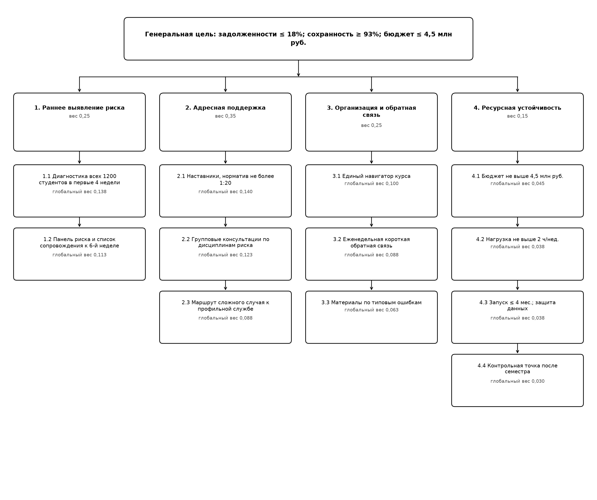

# ПРАКТИЧЕСКАЯ РАБОТА № 5

## «Разработка и принятие управленческих решений на основе экспертных методов»

**Исполнитель:** студент группы П-41 Соловьев А. С.  
**Тема письма:** `П-41_Соловьев_АС_ПЗ-05`  
**Год выполнения:** 2026

---

## 1. Название и цель работы

**Название работы:** «Разработка и принятие управленческих решений на основе экспертных методов».

**Цель работы:** развить практические навыки формулирования проблемной ситуации с количественными ограничениями, построения дерева целей, организации коллективной экспертизы, анализа альтернатив несколькими экспертными методами и выбора обоснованного управленческого решения [1, с. 143–155, 179].

## 2. Список исполнителей

Соловьев А. С., группа П-41.

Для учебной коллективной экспертизы использованы пять функциональных экспертных позиций: представитель учебного управления, преподаватель-методист, специалист по информационным технологиям, экономист и представитель студентов. Персональные данные других участников не приводятся; оценки представлены по ролям.

## 3. Проблемная ситуация

### 3.1. Описание ситуации и проблемы

В университете обучаются **1200 студентов первого курса**. По итогам последней зимней сессии **28%**, то есть 336 студентов, имели хотя бы одну академическую задолженность. До второго курса продолжили обучение **88%** набора, или 1056 студентов. Средняя оценка доступности учебных материалов и своевременности обратной связи составила **3,2 балла из 5**.

Ректорату необходимо принять решение о программе сопровождения первокурсников на следующий учебный год. Желаемое состояние:

- снизить долю студентов хотя бы с одной академической задолженностью с 28% до **18% или менее**;
- увеличить сохранность контингента с 88% до **93% или более**;
- повысить оценку доступности материалов и обратной связи до **4,0 из 5**;
- запустить программу не позднее начала нового учебного года.

**Проблема:** действующие способы организации материалов, диагностики затруднений и поддержки студентов не позволяют при имеющихся ресурсах одновременно обеспечить требуемое снижение задолженностей и рост сохранности контингента.

Для достижения целевого уровня необходимо уменьшить число студентов с задолженностями минимум на **120 человек**: 336 − 216 = 120, где 216 — 18% от 1200. Для достижения сохранности 93% необходимо удержать дополнительно не менее **60 студентов**: 1116 − 1056 = 60.

### 3.2. Количественные ограничения

| Ограничение | Предельное значение | Управленческий смысл |
|---|---|---|
| Бюджет программы | Не более 4,5 млн руб. на первый учебный год | В сумму должны входить настройка информационной системы, материалы, выплаты наставникам, обучение и резерв. |
| Срок запуска | Не более 4 месяцев | Основные сервисы должны быть готовы до начала учебного года. |
| Дополнительная нагрузка преподавателя | Не более 2 часов в неделю в среднем | Решение не должно создавать систематическую перегрузку преподавателей. |
| Проектный штат | Не более 2 новых штатных единиц | Остальные функции обеспечиваются существующими подразделениями и студенческими наставниками. |
| Охват диагностики | Все 1200 первокурсников | Нельзя ограничиться только добровольно обратившимися студентами, иначе часть риска останется невыявленной. |
| Ёмкость адресной поддержки | До 400 студентов группы риска | Поддержка должна покрывать текущие 336 случаев и резерв возможного роста. |
| Соотношение наставников и студентов | Не более 1:20 | Для 400 студентов требуется максимум 20 подготовленных наставников. |
| Защита данных | Использование действующей LMS и университетских учётных записей | Передача персональных учебных данных во внешнюю неподконтрольную систему запрещена. |
| Контрольная точка | Конец первого семестра | Программа продолжается или корректируется только после проверки промежуточных показателей. |

### 3.3. Ключевые зависимости

1. **Охват поддержки зависит от качества ранней диагностики.** Если группа риска определена неточно, наставники и консультации расходуются на студентов, не нуждающихся в интенсивной помощи, а часть реальных затруднений остаётся незамеченной.
2. **Эффект поддержки зависит от участия студентов.** Даже качественная программа не снижает задолженности, если посещаемость консультаций и контакт с наставником остаются низкими.
3. **Скорость обратной связи зависит от автоматизации.** Чем больше операций выполняется вручную, тем выше преподавательская нагрузка и тем медленнее обнаруживаются типовые ошибки.
4. **Автоматизация требует первоначальных затрат.** Снижение текущей нагрузки достигается только после настройки LMS, шаблонов курса и панели контроля.
5. **Сохранность контингента связана с задолженностями, но не определяется ими полностью.** На прекращение обучения также влияют мотивация, финансовые и личные обстоятельства, поэтому нужен маршрут передачи сложных случаев тьютору или профильной службе.
6. **Масштабирование зависит от результатов пилота.** Одновременный полный запуск без проверки повышает риск расходования бюджета на неработающие элементы.
7. **Бюджет, срок и качество взаимозависимы.** Сокращение срока может потребовать внешних исполнителей и увеличить стоимость; чрезмерное сокращение бюджета способно снизить точность диагностики и доступность поддержки.

## 4. Техническое задание на управленческое решение

**Заказчик:** проректор по учебной работе.  
**Объект решения:** система раннего выявления и сопровождения первокурсников.  
**Требуемый результат:** выбрать и запустить программу, обеспечивающую целевые показатели при соблюдении ограничений раздела 3.2.  
**Горизонт оценки:** один учебный год с контрольной точкой после первого семестра.  
**Обязательные результаты:** диагностический охват 1200 студентов, адресная поддержка до 400 студентов, измеримые показатели и возможность корректировки.  
**Недопустимые последствия:** превышение бюджета 4,5 млн руб., нагрузка преподавателя более 2 часов в неделю, нарушение требований к персональным данным и запуск позднее установленного срока.

## 5. Альтернативы решения

| Код | Альтернатива | Состав | Бюджет, млн руб. | Срок запуска | Нагрузка преподавателя | Экспертный прогноз |
|---|---|---|---|---|---|---|
| А | «Цифровая поддержка» | Диагностика в LMS, единый навигатор курса, автоматические напоминания и панель показателей для всех 1200 студентов. | 3,2 | 4 месяца | 0,8 ч/нед. | Задолженности 21%; сохранность 91%. |
| Б | «Наставнический центр» | Студенты-наставники, групповые консультации и ручное выявление группы риска до 400 человек. | 2,6 | 2 месяца | 2,0 ч/нед. | Задолженности 20%; сохранность 92%. |
| В | «Гибридная адресная программа» | LMS-диагностика и навигатор для всех; наставники, групповые консультации и еженедельная обратная связь для группы риска. | 4,2 | 4 месяца | 1,6 ч/нед. | Задолженности 17%; сохранность 94%. |
| Г | «Персональное интенсивное сопровождение» | Индивидуальный тьютор, персональный учебный план и дополнительные занятия для каждого студента группы риска. | 6,8 | 6 месяцев | 3,5 ч/нед. | Задолженности 14%; сохранность 95%. |

Альтернатива Г показывает высокий возможный эффект, но исходно нарушает три обязательных ограничения — бюджет, срок и допустимую нагрузку. Она сохраняется в анализе как сравнительный эталон максимальной интенсивности, но не является допустимым вариантом первого года.

## 6. Дерево целей

**Генеральная цель:** к концу учебного года снизить долю первокурсников с академическими задолженностями до 18% или менее и повысить сохранность контингента до 93% или более при бюджете не выше 4,5 млн руб.

**Рисунок 1 — Дерево целей программы сопровождения первокурсников**

Дерево построено по принципам чёткой иерархии и полноты: генеральная цель разделена на направления, направления — на измеримые задачи, а для задач определены средства достижения [1, с. 147–149].

## 7. Коллективная экспертиза дерева целей и альтернатив

### 7.1. Формирование экспертной группы

В экспертную группу включены пять компетентностных позиций:

| Экспертная позиция | Область компетенции | Коэффициент компетентности | Нормированный вес |
|---|---|---|---|
| Э1. Учебное управление | Регламенты, академические показатели, организация процесса | 0,90 | 0,221 |
| Э2. Преподаватель-методист | Методика обучения, консультации, нагрузка преподавателей | 0,85 | 0,208 |
| Э3. ИТ-специалист | LMS, данные, интеграция и информационная безопасность | 0,80 | 0,196 |
| Э4. Экономист | Бюджет, трудоёмкость, закупки и устойчивость затрат | 0,78 | 0,191 |
| Э5. Представитель студентов | Доступность поддержки, вовлечённость и пользовательский опыт | 0,75 | 0,184 |

Все коэффициенты выше рекомендуемого минимального уровня 0,67, указанного в учебном пособии [1, с. 148]. Нормированные веса получены делением коэффициента каждого эксперта на сумму коэффициентов 4,08.

### 7.2. Организация экспертизы

Экспертиза проведена в два тура.

1. Эксперты получили одинаковое техническое задание, дерево целей, количественные ограничения и описание альтернатив.
2. В первом туре каждый эксперт независимо проверил полноту дерева целей и выставил оценки вариантам по шкале от 1 до 5.
3. Координатор обезличенно обобщил замечания, средние оценки и расхождения.
4. Во втором туре эксперты уточнили оценки после знакомства с общей аргументацией, не обсуждая авторитет и личность участников.
5. Итоговый балл альтернативы рассчитан с учётом нормированных коэффициентов компетентности.
6. Согласованность мнений проверена коэффициентом вариации: чем он меньше, тем ближе позиции экспертов.

### 7.3. Критерии экспертной оценки

| Критерий | Вес | Содержание оценки |
|---|---|---|
| К1. Снижение академических задолженностей | 0,30 | Вероятность достижения уровня 18% или ниже. |
| К2. Сохранность контингента | 0,20 | Вероятность достижения уровня 93% или выше. |
| К3. Ресурсная и бюджетная реализуемость | 0,20 | Соблюдение бюджета и достаточность ресурсов. |
| К4. Срок и организационная выполнимость | 0,15 | Возможность запуска за четыре месяца и управляемость проекта. |
| К5. Дополнительная нагрузка | 0,10 | Соблюдение ограничения 2 часа в неделю. |
| К6. Масштабируемость и риск | 0,05 | Возможность расширения после пилота и управляемость неблагоприятных событий. |
| **Итого** | **1,00** |  |

### 7.4. Веса направлений дерева целей

Эксперты распределили важность между четырьмя направлениями:

| Направление дерева целей | Вес | Наиболее значимые задачи внутри направления |
|---|---|---|
| Раннее выявление риска | 0,25 | Диагностика в первые четыре недели — 0,55; панель риска — 0,45. |
| Адресная поддержка | 0,35 | Наставничество — 0,40; групповые консультации — 0,35; маршрут сложного случая — 0,25. |
| Организация обучения и обратной связи | 0,25 | Навигатор курса — 0,40; еженедельная обратная связь — 0,35; материалы по типовым ошибкам — 0,25. |
| Ресурсная устойчивость и контроль | 0,15 | Бюджет — 0,30; нагрузка — 0,25; срок и защита данных — 0,25; контрольная точка — 0,20. |

Наибольший вес получило направление адресной поддержки — 0,35. Среди отдельных задач максимальны глобальные веса наставничества — 0,140; ранней диагностики — 0,138; групповых консультаций — 0,123; панели риска — 0,113; навигатора курса — 0,100. Это означает, что сильная программа должна сочетать цифровое выявление риска с человеческой поддержкой.

### 7.5. Индивидуальные и коллективные оценки альтернатив

| Альтернатива | Э1 | Э2 | Э3 | Э4 | Э5 | Взвешенная коллективная оценка | Коэффициент вариации |
|---|---|---|---|---|---|---|---|
| А. Цифровая поддержка | 3,7 | 3,6 | 4,3 | 4,1 | 3,4 | 3,82 | 8,7% |
| Б. Наставнический центр | 3,8 | 4,2 | 3,4 | 4,0 | 4,4 | 3,95 | 8,7% |
| В. Гибридная адресная программа | 4,7 | 4,8 | 4,5 | 4,3 | 4,6 | **4,59** | **3,8%** |
| Г. Персональное интенсивное сопровождение | 2,5 | 2,7 | 2,6 | 1,8 | 2,4 | 2,41 | 13,2% |

Коллективная экспертиза выделила вариант В: он имеет максимальную оценку 4,59 и одновременно наименьший коэффициент вариации 3,8%, то есть эксперты не только оценили его выше, но и проявили наибольшую согласованность. Вариант Г получил низкую оценку вследствие нарушения обязательных ограничений.

## 8. Анализ ранее не применявшимся методом 1: морфологический анализ

Морфологический анализ расширяет область поиска посредством выделения характеристик задачи, вариантов их реализации и проверки совместимости комбинаций [1, с. 143–144].

### 8.1. Морфологическая матрица

| Параметр системы | Вариант 1 | Вариант 2 | Вариант 3 | Вариант 4 |
|---|---|---|---|---|
| Выявление риска | Нет отдельной диагностики | Ручные сигналы преподавателя | LMS-диагностика | LMS + данные об активности и сроках |
| Охват | Обратившиеся добровольно | Группа риска до 400 | Пилот 600 студентов | Все 1200 студентов |
| Основная поддержка | Автоматические рекомендации | Студенты-наставники | Групповые консультации | Наставник + консультации + маршрут сложного случая |
| Организация материалов | Разрознённые страницы курсов | Единый навигатор | Микролекции по ошибкам | Навигатор + материалы по типовым ошибкам |
| Обратная связь | Только итоговый контроль | Ежемесячный обзор | Еженедельный короткий опрос | Опрос + панель показателей и реакция преподавателя |
| Масштабирование | Одновременный полный запуск | Один факультет | Поэтапно по факультетам | Контрольная точка после семестра |

### 8.2. Проверка комбинаций

- Комбинация «адресная поддержка без диагностики» исключена: невозможно обоснованно определить её получателей.
- Индивидуальный тьютор для всех 400 студентов несовместим с бюджетом, сроком и нагрузкой.
- Панель риска без цифрового сбора данных создаёт избыточный ручной труд.
- Одновременный полный запуск без контрольной точки повышает риск масштабирования ошибки.
- Только автоматические рекомендации не обеспечивают поддержку сложных и мотивационных случаев.

Наиболее совместимой комбинацией признана следующая: **LMS-диагностика всех 1200 студентов → выделение группы риска до 400 → наставники и групповые консультации → единый навигатор и материалы по типовым ошибкам → еженедельный опрос и панель показателей → контрольная точка после первого семестра**. Эта морфологическая комбинация соответствует альтернативе В и уточняет её состав.

## 9. Анализ ранее не применявшимся методом 2: метод сценариев

Метод сценариев предназначен для анализа долгосрочных решений при нескольких правдоподобных вариантах будущего. В учебном пособии выделяются оптимистический, ожидаемый и пессимистический сценарии [1, с. 153–155].

Приняты условные экспертные вероятности: оптимистический сценарий — 0,20; ожидаемый — 0,55; пессимистический — 0,25.

| Альтернатива | Сценарий | Доля задолженностей | Сохранность | Затраты, млн руб. | Интерпретация |
|---|---|---|---|---|---|
| А | Оптимистический | 18,5% | 93% | 3,1 | Автоматические инструменты активно используются. |
| А | Ожидаемый | 21% | 91% | 3,2 | Организационный эффект есть, но человеческой поддержки недостаточно. |
| А | Пессимистический | 24% | 89% | 3,5 | Низкое участие и запоздалое реагирование. |
| Б | Оптимистический | 17,5% | 94% | 2,5 | Высокая активность наставников и студентов. |
| Б | Ожидаемый | 20% | 92% | 2,6 | Поддержка полезна, но ручное выявление риска неполно. |
| Б | Пессимистический | 23% | 90% | 2,9 | Наставники перегружены, часть риска обнаружена поздно. |
| В | Оптимистический | 14,5% | 96% | 4,1 | Высокое участие и своевременная цифровая диагностика. |
| В | Ожидаемый | 17% | 94% | 4,2 | Основные элементы работают в запланированном режиме. |
| В | Пессимистический | 19,5% | 92% | 4,6 | Задержка интеграции, низкая активность и рост затрат. |
| Г | Оптимистический | 12% | 97% | 6,5 | Интенсивная индивидуальная работа даёт максимальный эффект. |
| Г | Ожидаемый | 14% | 95% | 6,8 | Высокий эффект при недопустимых ресурсах. |
| Г | Пессимистический | 18% | 92% | 7,5 | Рост затрат и кадровый дефицит. |

### 9.1. Ожидаемые значения

| Альтернатива | Ожидаемая доля задолженностей | Ожидаемая сохранность | Ожидаемые затраты | Вывод |
|---|---|---|---|---|
| А | 21,3% | 90,9% | 3,26 млн руб. | Не достигает обеих основных целей. |
| Б | 20,3% | 91,9% | 2,66 млн руб. | Улучшает ситуацию, но не достигает целевых уровней. |
| В | **17,1%** | **93,9%** | **4,28 млн руб.** | Достигает целей по ожидаемому сценарию и соблюдает бюджет. |
| Г | 14,6% | 94,7% | 6,92 млн руб. | Эффективна, но недопустима по бюджету и нагрузке. |

Сценарный анализ подтверждает выбор варианта В, но выявляет уязвимость пессимистического сценария: возможны затраты 4,6 млн руб. и недостижение целевых показателей. Поэтому решение должно содержать контрольные триггеры и резервные действия.

### 9.2. Триггеры корректировки

- если интеграция LMS задерживается более чем на две недели, временно используется защищённый реестр риска внутри университетской инфраструктуры;
- если участие группы риска ниже 65%, усиливаются персональные приглашения и перераспределяются наставники;
- если прогноз затрат превышает 4,4 млн руб., откладываются необязательные функции аналитической панели, но сохраняются диагностика, навигатор и поддержка;
- если промежуточная доля задолженностей выше 22%, увеличивается число групповых консультаций за счёт ротации преподавателей без превышения средней нагрузки 2 часа;
- если коэффициент выбытия превышает траекторию 7% за семестр, сложные случаи передаются тьютору и профильным службам.

## 10. Окончательное управленческое решение

**Принять к реализации альтернативу В — гибридную адресную программу сопровождения первокурсников — в форме ограниченного по ресурсам пилота с контрольной точкой после первого семестра.**

### 10.1. Состав утверждаемой программы

1. Провести LMS-диагностику и анализ активности всех 1200 первокурсников в первые четыре недели.
2. Сформировать динамическую группу риска численностью до 400 студентов.
3. Подготовить до 20 студенческих наставников при нормативе не более 20 подопечных на одного наставника.
4. Организовать групповые консультации по дисциплинам с максимальной долей задолженностей.
5. Создать единый навигатор курса и материалы по типовым ошибкам.
6. Ввести еженедельную короткую обратную связь и панель показателей для ответственных лиц.
7. Предусмотреть передачу сложных случаев тьютору, психологической, социальной или иной профильной службе.

### 10.2. Бюджет решения

| Статья | Сумма, млн руб. |
|---|---|
| Настройка LMS, диагностики и панели показателей | 1,6 |
| Создание навигаторов и учебных материалов | 0,8 |
| Подготовка и выплаты студенческим наставникам | 1,0 |
| Методическая подготовка и организация консультаций | 0,4 |
| Резерв на риски и корректировки | 0,4 |
| **Итого** | **4,2** |

### 10.3. Этапы и показатели контроля

| Срок | Управленческий результат | Контрольный показатель |
|---|---|---|
| Месяц 1 | Утверждение технического задания, ответственных и состава данных | Бюджет утверждён; требования к данным согласованы. |
| Месяцы 2–3 | Настройка LMS, шаблонов курса и подготовка наставников | Система протестирована; до 20 наставников прошли обучение. |
| Месяц 4 | Запуск для всех первокурсников | Диагностикой охвачено не менее 95% набора в установленный период. |
| Конец первого семестра | Экспертная контрольная точка | Участие группы риска не ниже 65%; прогноз затрат не выше 4,5 млн руб.; выявлены причины отклонений. |
| Конец учебного года | Итоговая оценка | Задолженности не выше 18%; сохранность не ниже 93%; обратная связь не ниже 4,0 из 5; нагрузка не выше 2 ч/нед. |

Решение считается окончательно подтверждённым для масштабирования только при достижении обязательных показателей либо наличии обоснованного корректирующего плана, одобренного повторной коллективной экспертизой.

## 11. Выводы

1. Сформулированная проблема имеет измеримый разрыв: необходимо сократить число первокурсников с задолженностями минимум на 120 человек и удержать дополнительно не менее 60 студентов.
2. Количественные ограничения по бюджету, сроку, нагрузке, штату, охвату и защите данных позволили отделить желательные решения от допустимых.
3. Дерево целей показало, что результат зависит от четырёх взаимосвязанных направлений: ранней диагностики, адресной поддержки, организации обучения и ресурсной устойчивости.
4. Коллективная экспертиза пяти компетентностных позиций дала максимальную оценку гибридной программе — 4,59 балла при наименьшем коэффициенте вариации 3,8%.
5. Морфологический анализ подтвердил необходимость совместимой комбинации цифровой диагностики, человеческой поддержки, навигатора, обратной связи и контрольной точки.
6. Сценарный метод показал, что ожидаемые показатели гибридной программы составляют 17,1% задолженностей, 93,9% сохранности и 4,28 млн руб. затрат. Он также выявил риски пессимистического сценария и позволил сформулировать триггеры корректировки.
7. Окончательно выбрана гибридная адресная программа с бюджетом 4,2 млн руб., запуском за четыре месяца и контрольной экспертизой после первого семестра.

## 12. Список использованных источников

1. Лукычёва Л. И. Управление организацией: учебное пособие по специальности «Менеджмент организации» / Л. И. Лукычёва; под ред. Ю. П. Анискина. — 3-е изд., стер. — М.: Омега-Л, 2006. — 360 с. — ISBN 5-98119-986-5. — С. 143–155, 179.
2. Литвак Б. Г. Экспертные технологии в управлении: учебное пособие. — 2-е изд., испр. и доп. — М.: Дело, 2004.
3. Ожегов С. И., Шведова Н. Ю. Толковый словарь русского языка: 80 000 слов и фразеологических выражений. — 4-е изд., доп. — М.: Азбуковник, 1999.

## Приложение А. Краткий словарь терминов для защиты

**Принятие решения** — осознанный выбор уполномоченным лицом определённой альтернативы с принятием ответственности за её реализацию и последствия.

**Альтернатива** — взаимоисключающий способ действия, сопоставляемый с другими способами для последующего выбора.

**Цель** — осознанный желаемый результат деятельности, выраженный качественно и, по возможности, количественно.

**Задача** — конкретный результат или действие, необходимые для достижения цели в установленных условиях и сроках.

**Критерий** — признак, показатель или правило, по которому оцениваются и сравниваются альтернативы.

**Эталон** — образец, нормативное или целевое значение, используемые как база сравнения; в работе эталонами выступают уровни 18% задолженностей и 93% сохранности.

**Техническое задание** — документированное описание требуемого результата, исходных данных, ограничений, критериев приёмки, сроков и ответственности за решение.

**Проблема** — противоречие или разрыв между фактическим и желаемым состоянием, способ устранения которого необходимо определить.

**Ограничение** — обязательное условие, сужающее множество допустимых решений или доступный объём ресурсов.

**Ресурс** — средство или возможность, используемые для достижения цели: деньги, время, персонал, информация, инфраструктура и полномочия.

**Экспертный метод** — способ разработки или оценки решения, основанный на формализованном сборе, сопоставлении и обобщении профессиональных суждений компетентных лиц.

**Эксперт** — специалист, обладающий знаниями и опытом в рассматриваемой области и привлекаемый для аргументированной оценки проблемы, альтернатив или последствий решения.
